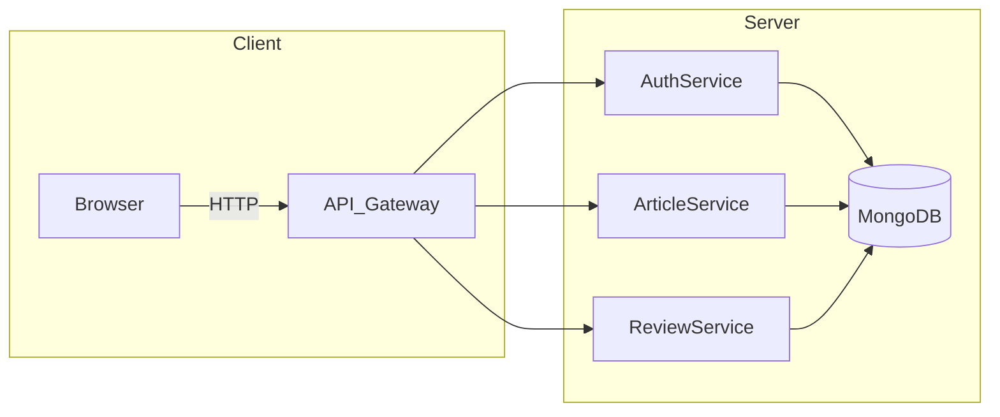

<p align="center">
  
</p>
<p align="center">
  <a href="https://github.com/YourUser/YourRepo/actions">
    
  </a>
  <a href="https://coveralls.io/github/YourUser/YourRepo?branch=main">
    
  </a>
  <a href="https://www.npmjs.com/package/your-package">
    
  </a>
  <a href="https://github.com/YourUser/YourRepo/blob/main/LICENSE">
    
  </a>
</p>

# 🧠Backend API Documentation

## Giới thiệu
>Backend API được xây dựng bằng Node.js và Express, sử dụng MongoDB làm cơ sở dữ liệu. API cung cấp các chức năng quản lý bài báo khoa học, tác giả, phản biện và quy trình xuất bản.

## 🏛️ Kiến trúc hệ thống




## Yêu cầu hệ thống
- Node.js (v14 trở lên)
- MongoDB (v4.4 trở lên)
- npm hoặc yarn

## Cài đặt
1. Clone repository
```bash
git clone [repository-url]
cd backend
```

2. Cài đặt dependencies
```bash
npm install
# hoặc
yarn install
```

3. Tạo file .env từ .env.example và cấu hình các biến môi trường
```bash
cp .env.example .env
```

4. Chạy server
```bash
npm run dev
# hoặc
yarn dev
```

## Cấu trúc thư mục
```
backend/
├── config/           # Cấu hình ứng dụng
├── controllers/      # Xử lý logic nghiệp vụ
├── middlewares/      # Middleware xác thực và phân quyền
├── models/          # Schema và model MongoDB
├── routes/          # Định nghĩa routes
├── utils/           # Tiện ích và helper functions
├── .env             # Biến môi trường
├── .env.example     # Mẫu biến môi trường
└── server.js        # Điểm khởi đầu ứng dụng
```

## API Endpoints

### Quản lý bài báo
- `GET /api/articles` - Lấy danh sách bài báo
- `POST /api/articles` - Tạo bài báo mới
- `GET /api/articles/:id` - Lấy chi tiết bài báo
- `PUT /api/articles/:id` - Cập nhật bài báo
- `DELETE /api/articles/:id` - Xóa bài báo

### Quản lý tác giả
- `GET /api/article-authors` - Lấy danh sách tác giả
- `POST /api/article-authors` - Tạo tác giả mới
- `GET /api/article-authors/:id` - Lấy chi tiết tác giả
- `PUT /api/article-authors/:id` - Cập nhật tác giả
- `DELETE /api/article-authors/:id` - Xóa tác giả

### Quản lý phản biện
- `GET /api/reviews` - Lấy danh sách phản biện
- `POST /api/reviews` - Mời một phản biện
- `POST /api/reviews/multiple` - Mời nhiều phản biện cùng lúc
- `GET /api/reviews/:id` - Lấy chi tiết phản biện
- `PUT /api/reviews/:id` - Cập nhật phản biện
- `DELETE /api/reviews/:id` - Xóa phản biện

### Hành động phản biện
- `POST /api/reviews/:id/accept` - Chấp nhận lời mời phản biện
- `POST /api/reviews/:id/decline` - Từ chối lời mời phản biện
- `POST /api/reviews/:id/complete` - Hoàn thành phản biện
- `POST /api/reviews/:id/reminder` - Gửi nhắc nhở phản biện

## Xác thực và Phân quyền
API sử dụng JWT (JSON Web Token) để xác thực. Các role được hỗ trợ:
- `admin`: Quản trị viên hệ thống
- `editor`: Biên tập viên
- `reviewer`: Phản biện
- `author`: Tác giả

## Các tính năng chính
1. Quản lý bài báo khoa học
   - Tạo và quản lý bài báo
   - Theo dõi trạng thái bài báo
   - Quản lý phiên bản và file đính kèm

2. Quản lý tác giả
   - Thêm và quản lý tác giả
   - Liên kết tác giả với bài báo
   - Hỗ trợ tác giả có tài khoản và không có tài khoản

3. Quản lý phản biện
   - Mời phản biện (đơn lẻ hoặc hàng loạt)
   - Theo dõi tiến độ phản biện
   - Gửi nhắc nhở tự động

4. Quy trình xuất bản
   - Quản lý vòng phản biện
   - Xử lý yêu cầu sửa đổi
   - Xuất bản bài báo

## Bảo mật
- Xác thực JWT
- Phân quyền chi tiết
- Bảo vệ API endpoints
- Mã hóa dữ liệu nhạy cảm

## Phát triển
1. Fork repository
2. Tạo branch mới (`git checkout -b feature/amazing-feature`)
3. Commit changes (`git commit -m 'Add some amazing feature'`)
4. Push to branch (`git push origin feature/amazing-feature`)
5. Tạo Pull Request
